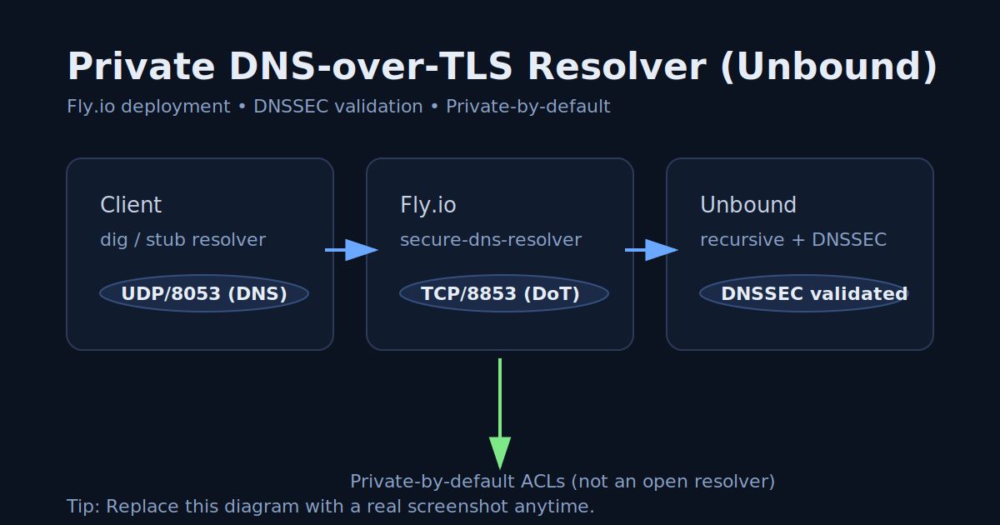

# Private DNS-over-TLS Resolver (Unbound)

Live deployment: [https://secure-dns-resolver.fly.dev/](https://secure-dns-resolver.fly.dev/)

(Plain DNS over UDP: `secure-dns-resolver.fly.dev:8053`)



A small, private-by-default DNS resolver written with Unbound.
It performs iterative recursion with DNSSEC validation and supports DNS-over-TLS (DoT).

This is designed for **home-lab / learning / portfolio** use.
It is **not** intended to be a public open resolver.

---

## Quick start (Windows)

1) Prereqs: [docs/setup.md](docs/setup.md)

2) Generate local lab certs (never commit):

```
powershell -ExecutionPolicy Bypass -File scripts/gen-dot-certs.ps1
```

3) Run locally (container + runtime-injected TLS):
- [docs/local_dev.md](docs/local_dev.md)

4) Test:
- Plain DNS: `dig @127.0.0.1 example.com A +dnssec`
- DoT + more checks: [docs/testing.md](docs/testing.md)

## Fly.io

- Deploy guide: [docs/fly.md](docs/fly.md)
- Notes and abuse-prevention assumptions: [docs/threat_model.md](docs/threat_model.md)

## Repo hygiene

Do not commit generated TLS materials.

- Keep these local only: `certs/*.key`, `certs/*.pem`, `certs/*.csr`, `certs/*.srl`
- If you ever accidentally pushed certs/keys: regenerate and purge git history

---

## License

[](https://opensource.org/licenses/MIT)


---

## Author

Jeremy Ray Jewell  
[GitHub](https://github.com/jeremyrayjewell) · [LinkedIn](https://www.linkedin.com/in/jeremyrayjewell)